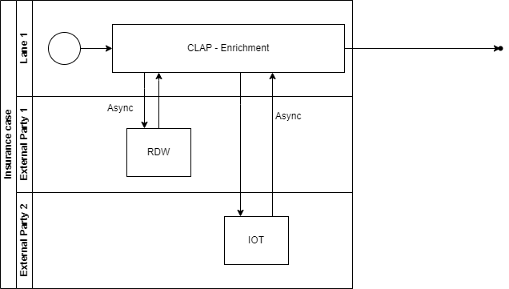
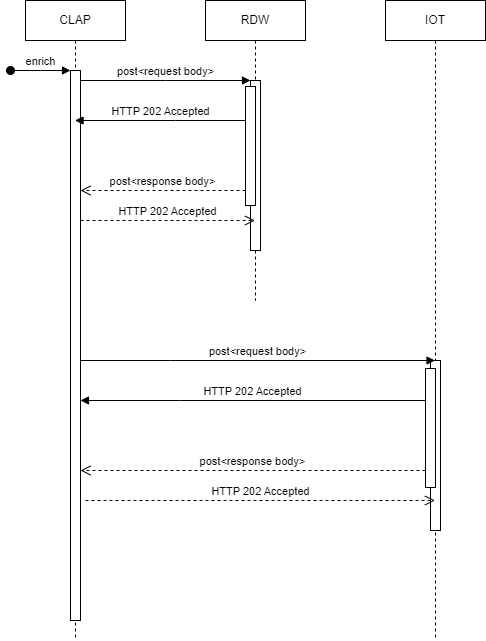

## Focus Part 1
Enriching the insurance_case by async calls to external systems
- [ ] enrich insurance_case with data involved car owner information, assumed driver
- [ ] enrich insurance_case with driver Insurance Tier information

### Activity - Enrichment

### REST sequence


**Activity Enrichment**
```java
    @ActivityMethod(name = "Retrieve license plate from RDW system")
    void determineDriver(InsuranceCaseDto insuranceCaseDto, String workflowId);
```
**Application service: [RdwService.java](..%2Fsrc%2Fmain%2Fjava%2Fnl%2Fwlagemaat%2Fdemo%2Fclap%2Fservice%2FRdwService.java)** called from the Activity
```java
    public void sendDriverRequestToRdw(final InsuranceCaseDto insuranceCaseDto, String workflowId) {
        insuranceCase = repository.findInsuranceCase(insuranceCaseDto);
        ...
        RdwRequest requestDto = new RdwRequest(insuranceCase.get().getLicensePlate(), insuranceCaseDto.rdwOdds(), workflowId);
        restService.sendRequestForRDWDriver(rdwRequestUrl, requestDto);
    }
```
When receiving the **202 - Accepted** the temporal workflow is put in waiting 

> RDW doing its magic and returning the async response

**Application controller: [RdwController.java](..%2Fsrc%2Fmain%2Fjava%2Fnl%2Fwlagemaat%2Fdemo%2Fclap%2Fcontroller%2FRdwController.java)** is the endpoint to continue the flow
```
    @PostMapping("/rdw"
    public ResponseEntity updateDriver(@RequestBody RdwResponseSignal driver) {
        
        caseIntakeWorkflowService.rdwSignal(driver);

        return ResponseEntity.accepted().build();
    }
```
Connecting the response back to the correlated WorkFlow:

[CaseIntakeWorkflowService.java](..%2Fsrc%2Fmain%2Fjava%2Fnl%2Fwlagemaat%2Fdemo%2Fclap%2Fservice%2FCaseIntakeWorkflowService.java)
```
    public void rdwSignal(@Nonnull RdwResponseSignal signal) {
        temporalService.runningIntakeFlow(signal.workflowId(), "driverByRDWSignal", signal.driver());
    }
```
[TemporalService.java](..%2Fsrc%2Fmain%2Fjava%2Fnl%2Fwlagemaat%2Fdemo%2Fclap%2Fworkflow%2FTemporalService.java)
```
    public void runningIntakeFlow(String workflowId, String signalName, Object signalValue) {
        WorkflowExecution workflowExecution = WorkflowExecution.newBuilder().setWorkflowId(workflowId).build();
        WorkflowStub workflow = getWorkflowClient().newUntypedWorkflowStub(workflowExecution);
        workflow.signal(signalName, signalValue);
    }
```
and we are back in track in the [IntakeWorkflow.java](..%2Fsrc%2Fmain%2Fjava%2Fnl%2Fwlagemaat%2Fdemo%2Fclap%2Fworkflow%2Fintakeflow%2FIntakeWorkflowImpl.java)
```
    @WorkflowMethod
    InsuranceCaseValidationEnrichmentResult insuranceCaseIntake(InsuranceCaseDto fine);
        ...        
        checkRDWActivity.determineDriver(enrichedFine, Workflow.getWorkflowId());

        Workflow.await(() -> rdwResult.isPresent());

        updateInsuranceCaseActivity.updateDriverInsuranceCase(insuranceCaseNumber, rdwResult.get());
        ...
        ...
    }
```
source: https://docs.temporal.io/workflows#signal